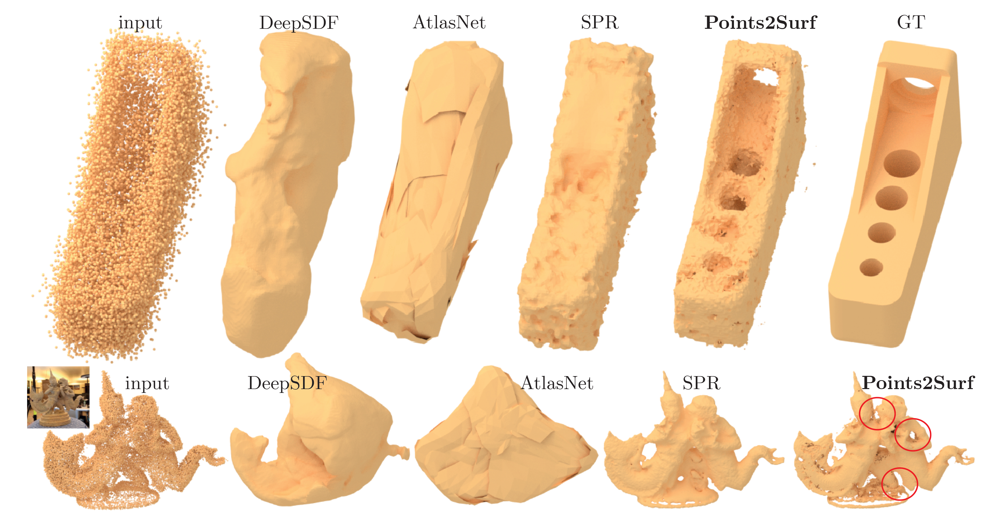

# Points2Surf (ECCV 2020)
Learning Implicit Surfaces from Point Clouds


## This is a placeholder! We will add the source code until ECCV 2020.


This is our implementation of [Points2Surf](https://www.cg.tuwien.ac.at/research/publications/2020/erler-p2s/),
a network that estimates a signed distance function from point clouds. This SDF is turned into a mesh with Marching Cubes.



The architecture is similar to [PCPNet](https://github.com/paulguerrero/pcpnet/). In contrast to other ML-based surface reconstruction methods, e.g. [DeepSDF](https://github.com/facebookresearch/DeepSDF) and [AtlasNet](https://github.com/ThibaultGROUEIX/AtlasNet), Points2Surf is patch-based and therefore independent from classes. The strongly improved generalization leads to much better results, even better than [Screened Poisson Surface Reconstruction](http://hhoppe.com/proj/screenedpoisson/) in most cases.

This code was mostly written by [Philipp Erler](https://philipperler.net/) and [Paul Guerrero](https://paulguerrero.github.io).
This work was published at [ECCV 2020](https://eccv2020.eu/).


## Prerequisites
* Python ≥ 3.7
* PyTorch ≥ 1.2
* CUDA and CuDNN if using GPU
* BlenSor 1.0.18 RC 10 for dataset generation


## Setup

We recommend using [Anaconda](https://anaconda.org/) to manage the Python environment. Otherwise, you can install the required packages with Pip as defined in the requirements.txt.

This code gives you a minimal working example:
``` bash
# clone this repo
# a minimal working dataset is included
git clone https://github.com/ErlerPhilipp/points2surf.git

# go into the cloned dir
cd points2surf

# create a conda environment with the required packages
conda env create --file p2s.yml

# activate the new conda environment
conda activate p2s

# train and evaluate the vanilla model with default settings
python full_run.py
```


## Reconstruct Surface

To reconstruct a mesh from a point cloud using the default settings and our test sets:
``` bash
# download the test datasets
python datasets/download_datasets_abc.py
python datasets/download_datasets_famous.py
python datasets/download_datasets_thingi10k.py

# download the pre-trained models
python models/download_models_vanilla.py
python models/download_models_ablation.py

python full_eval.py
```
This outputs meshes from the test sets using the vanilla model described in the paper.
To use other models and datasets, either modify the `full_eval.py`, edit the default arguments defined in the first lines of `source/points_to_surf_eval.py` or modify and run the scripts in the `experiments` directory (call from root dir).
The evaluation experiments are meant for a normal PC with e.g. a 1070 GTX.


## Training
To train P2S with the default settings and our training set:
``` bash
# download all datasets
python datasets/download_datasets_abc_training.py

python full_train.py
```
This trains the vanilla model described in the paper on the training set used in the paper.

To train on a different dataset, either modify the `full_train.py`, edit the default arguments defined in the first few lines of `source/points_to_surf_train.py` or modify and run the scripts in the `experiments` directory (call from root dir).
The training experiments are meant for a strong training machine with e.g. 4x2080TI RTX.

With 4 RTX 2080Ti, we trained around 5 days to 150 epochs. Full convergence is at 200-250 epochs but the Chamfer distance doesn't change much. The topological noise might be reduced, though.


## Make your own Datasets

The point clouds are stored as [NumPy](https://numpy.org/) arrays of type np.float32 with ending `.npy` where each line contains the 3 coordinates of a point. The point clouds need to be normalized to the (-1..+1)-range.

A dataset is given by a text file containing the file name (without extension) of one point cloud per line. The file name is given relative to the location of the text file.


### Dataset from Meshes

To make your own dataset from meshes, place your ground-truth meshes in `./datasets/(DATASET_NAME)/00_base_meshes/`. Meshes must be of a type that [Trimesh](https://trimsh.org/) can load, e.g. `.ply`, `.stl`, `.obj` or `.off`. Because we need to compute signed distances for the training set, these input meshes must represent solids, i.e be manifold and watertight. Triangulated CAD objects as in the [ABC-Dataset](https://archive.nyu.edu/handle/2451/43778) work in most cases. Next, create the text file `./datasets/(DATASET_NAME)/settings.ini` with the following settings:
``` ini
[general]
only_for_evaluation = 0
grid_resolution = 256
epsilon = 5
num_scans_per_mesh_min = 5
num_scans_per_mesh_max = 30
scanner_noise_sigma_min = 0.0
scanner_noise_sigma_max = 0.05
```
When you set `only_for_evaluation = 1`, the dataset preparation script skips most processing steps and produces only the text file for the test set.

For the point-cloud sampling, we used [BlenSor 1.0.18 RC 10](https://www.blensor.org/). Windows users need to fix [a bug in the BlenSor code](https://github.com/mgschwan/blensor/issues/30). Make sure that the `blensor_bin` variable in `make_dataset.py` points to your BlenSor binary, e.g. `blensor_bin = "bin/Blensor-x64.AppImage"`.

You may need to change other paths or the number of worker processes in `make_dataset.py`. Then, run: 
```
python make_dataset.py
```

The ABC var-noise dataset with about 5k shapes takes around 8 hours using 15 worker processes on a Ryzen 7. Most computation time is required for the sampling and the GT signed distances.


### Dataset from Point Clouds

If you only want to reconstruct your own point clouds, place them in `./datasets/(DATASET_NAME)/00_base_pc/`. The accepted file types are the same as for meshes.

You may need to change some settings like the number of worker processes in `make_dataset_pc.py`. Then, run: 
```
python make_dataset_pc.py
```

In case you already have your point clouds as Numpy files, you can create a dataset manually. Put the *.npy files in the `(DATASET_NAME)/04_pts/` directory. Then, you need to list the names (without extensions, one per line) in a textfile `(DATASET_NAME)/testset.txt`.


## Citation
If you use our work, please cite our paper:
```
@article{ErlerEtAl:Points2Surf:ECCV:2020,
  title   = {{Points2Surf}: Learning Implicit Surfaces from Point Clouds}, 
  author  = {Philipp Erler and Paul Guerrero and Stefan Ohrhallinger and Michael Wimmer and Niloy J. Mitra},
  year    = {2020},
  journal = {?},
  volume = {?},
  number = {?},
  pages = {?},
  doi = {?},
}
```
